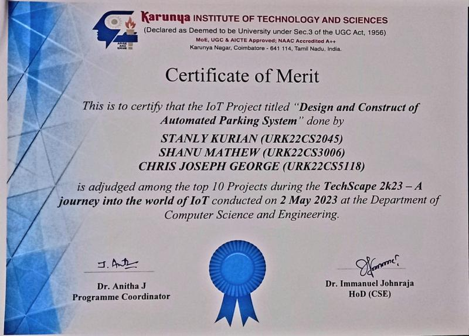

# Automated Parking System with IoT Integration

## Overview
This project demonstrates an Automated Parking System with IoT integration using Arduino Uno, IR sensors, Servo motors, and a mobile app. It includes five parking lots with the ability to detect and reserve parking spaces remotely via a mobile app.

## Features
- Five parking lots with individual IR sensors and Servo motors.
- Mobile app to check parking lot availability and reserve spaces.
- Automated gate control based on car detection.

## Hardware Requirements
- Arduino Uno or compatible IoT board
- IR Sensor Modules (5 units)
- Servo Motors (5 units)
- Motor Drivers (if required)
- Mobile App Development Platform
- Wi-Fi Module (e.g., ESP8266 or ESP32 for IoT connectivity)
- Breadboard and jumper wires

## Arduino Setup
1. Connect the hardware components according to the circuit diagram.
2. Upload the Arduino sketch (`parking_system.ino`) to the Arduino board.

## Mobile App
1. Develop the mobile app using your preferred development platform.
2. Ensure the app can connect to the Arduino's IP address on the local network.
3. Implement functionality to check parking lot availability and reserve spaces.

## Usage
- Run the Arduino code on the board.
- Launch the mobile app on your smartphone.
- Connect the app to the Arduino's IP address.
- Check parking lot availability and reserve spaces as needed.

## License
This project is licensed under the MIT License - see the [LICENSE](LICENSE) file for details.

## Acknowledgments
- [Arduino](https://www.arduino.cc/)
- [MIT App Inventor](https://appinventor.mit.edu/)

Feel free to contribute, report issues, or make suggestions for improvements.

For questions and support, please contact [Your Email].
